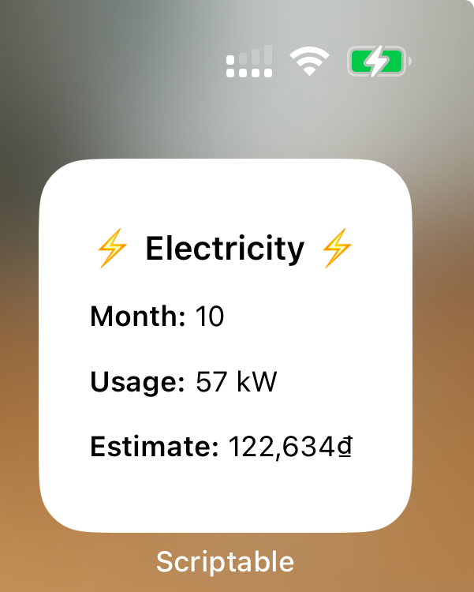

# [Scriptable](https://scriptable.app) scripts

This repository contains javascript code to generate widgets on iOS using an app called Scriptable.

It's just a fun project to help myself tracking important information easily such as electricity bill, critical weather messages, etc... without opening multiple pages manually.

Example:

